# Gambar Test
## All-Student
### Result in Table
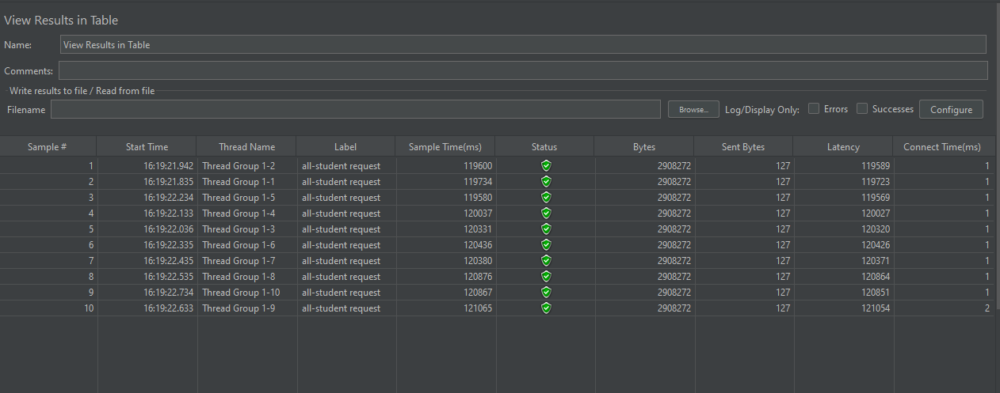
### Result Tree
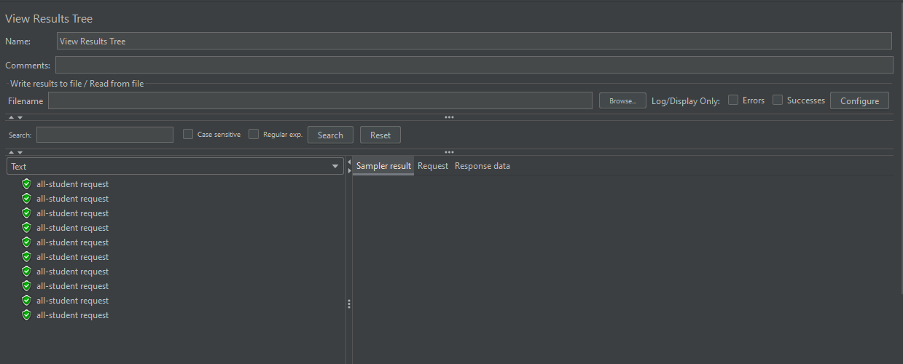
### Summary Report
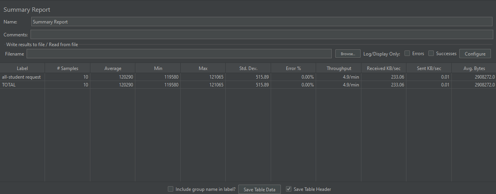
### Graph Result
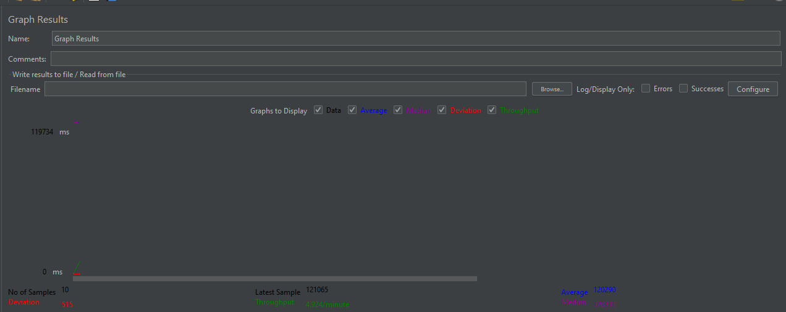

## All-Student-Name
### Result in Table
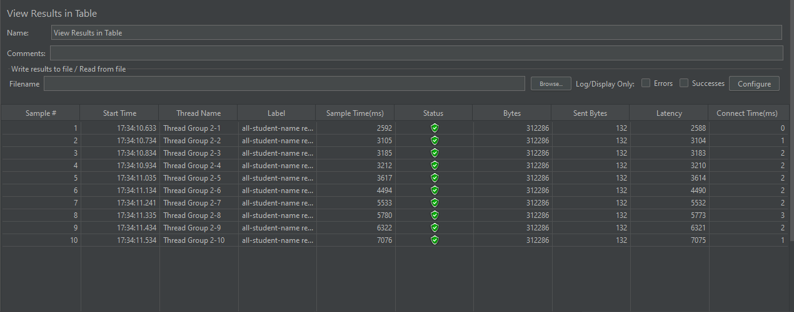
### Result Tree
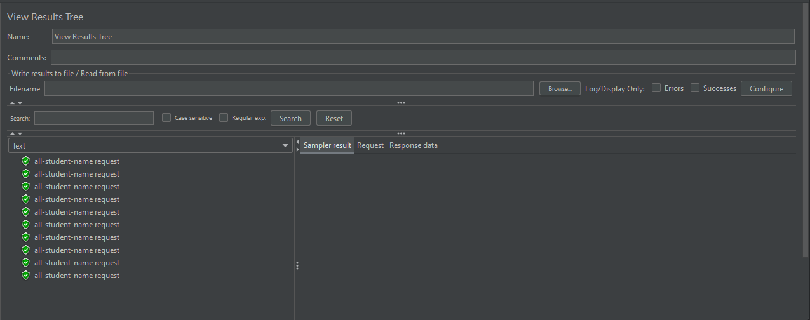
### Summary Report
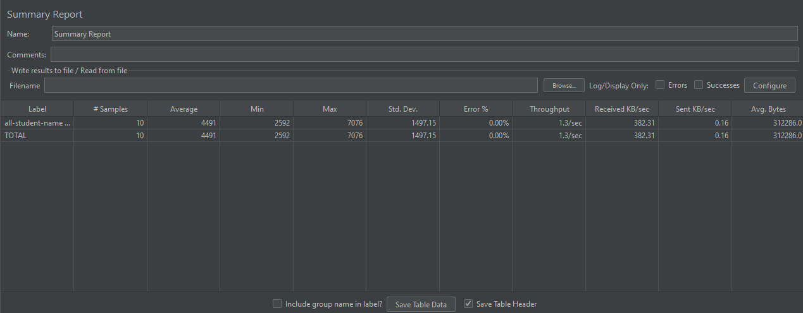
### Graph Result
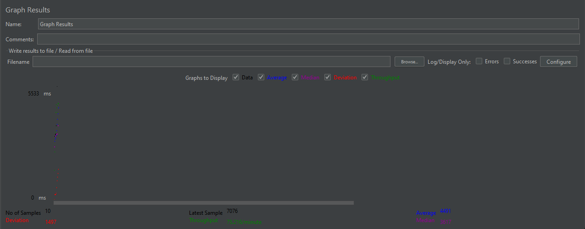
### Request
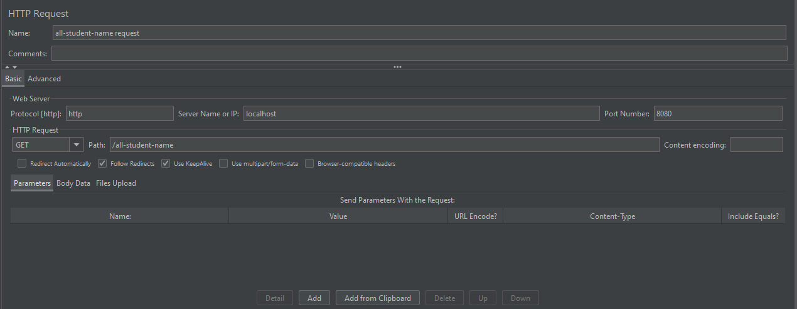

## Highest-GPA
### Result in Table

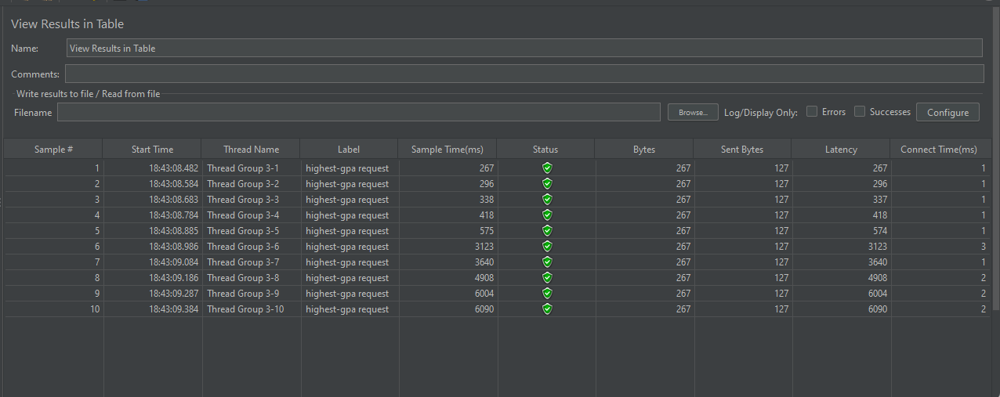
### Result Tree
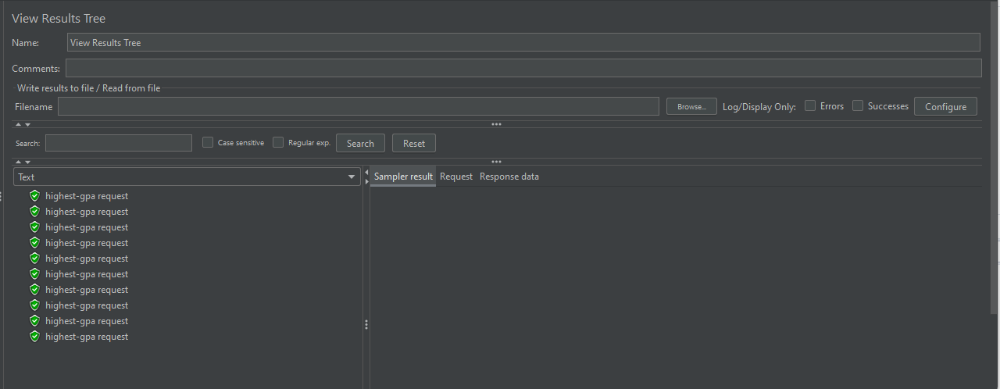
### Summary Report
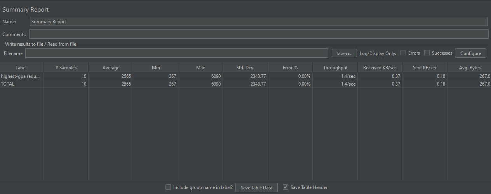
### Graph Result
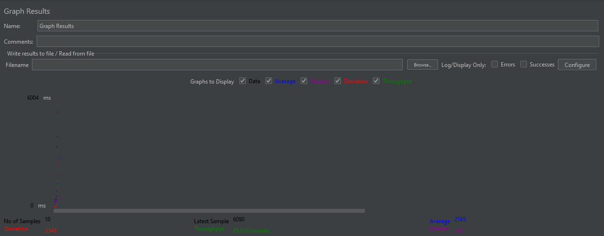
### Request
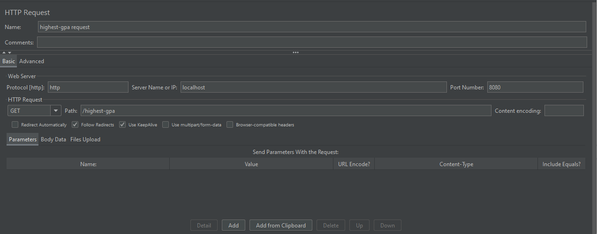

## Test-Plan (kumpulan)
### Gambar Terminal
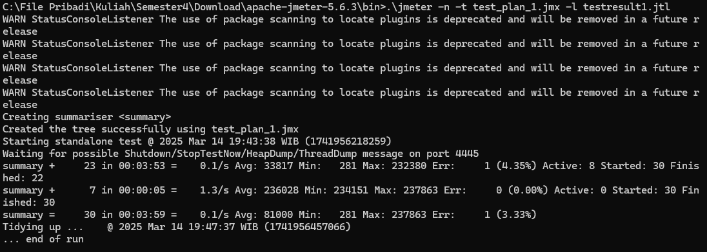
### Hasil
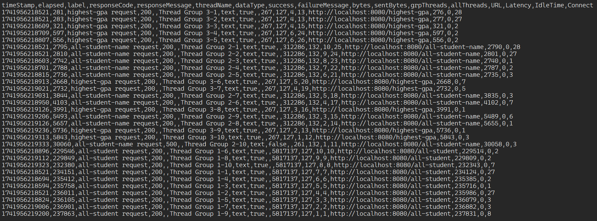

# Komparasi

### Perbandingan Performa Setelah Optimasi

Setelah melakukan profiling menggunakan IntelliJ Profiler dan menerapkan optimasi kode (misalnya mengurangi masalah N+1 queries, hanya mengambil kolom yang dibutuhkan, serta menggunakan query langsung untuk GPA tertinggi), menjalankan kembali pengujian performa JMeter pada endpoint `/all-student`, `/all-student-name`, dan `/highest-gpa`. Berikut ringkasan hasil dibandingkan pengujian awal:

1. **Waktu Respons Lebih Singkat**  
   Rata-rata dan median waktu respons turun sangat drastis pada ketiga endpoint, menandakan aplikasi kini menangani permintaan lebih efisien.

2. **Penggunaan CPU Lebih Rendah**  
   Berdasarkan pemantauan sumber daya di JMeter (dan log IntelliJ Profiler), penggunaan CPU selama pengujian beban tinggi menurun secara signifikan. Ini karena jumlah panggilan ke database sudah diminimalkan dan operasi seperti penggabungan string lebih efisien.

3. **Throughput Lebih Tinggi**  
   Jumlah permintaan per detik (throughput) meningkat, menunjukkan server mampu menangani lebih banyak permintaan bersamaan tanpa penurunan performa yang signifikan.

# Refleksi

**1. Perbedaan Pendekatan antara Performance Testing (JMeter) dan Profiling (IntelliJ Profiler)**  
Menurut saya, JMeter berperan sebagai alat “black-box testing” untuk melihat bagaimana aplikasi merespons beban tertentu. Saya menggunakannya untuk mengukur waktu respons, throughput, dan beragam metrik lain di level permukaan. Sementara itu, IntelliJ Profiler memberikan wawasan “white-box”, yaitu memperlihatkan detail internal kinerja kode, penggunaan CPU, hingga metode mana yang paling membebani aplikasi. Bagi saya, JMeter cocok untuk simulasi beban dan menguji stabilitas sistem, sedangkan IntelliJ Profiler membantu saya menelusuri akar masalah di dalam kode.

**2. Bagaimana Profiling Membantu Mengidentifikasi Titik Lemah Aplikasi**  
Saat melakukan profiling, saya dapat melihat diagram seperti flame graph atau call tree yang menyoroti metode-metode mana yang memakan waktu paling banyak. Dengan begitu, saya bisa segera tahu lokasi pasti di kode yang menjadi biang keladi lamanya eksekusi. Hasil tersebut sangat membantu saya mengurutkan prioritas perbaikan.

**3. Efektivitas IntelliJ Profiler dalam Menganalisis Bottleneck**  
Menurut pengalaman saya, IntelliJ Profiler sangat efektif karena menampilkan data CPU time dan total time secara rinci. Saya bisa langsung melihat metode apa yang sering muncul di puncak flame graph serta mengecek apakah ada terlalu banyak query atau operasi String berulang. Hal ini mempercepat proses perbaikan dibandingkan menebak-nebak secara manual.

**4. Tantangan dalam Performance Testing dan Profiling, serta Cara Mengatasinya**  
Saya menemukan bahwa menyiapkan lingkungan pengujian yang mirip produksi menjadi tantangan tersendiri. Terkadang, data seeding memakan waktu lama, atau hasil pengujian tidak konsisten karena faktor konfigurasi hardware. Untuk mengatasinya, saya selalu berusaha menyiapkan database dengan data memadai, mengulang tes beberapa kali, serta membandingkan log di setiap percobaan. Saya juga menyesuaikan jumlah thread di JMeter supaya sesuai konteks pemakaian aplikasi di dunia nyata.

**5. Manfaat Penggunaan IntelliJ Profiler**  
Bagi saya, manfaat utamanya adalah efisiensi waktu. Dengan profiler, saya tidak perlu menebak-nebak letak bottleneck. Profiler menampilkan bukti konkret mengapa, misalnya, suatu metode lebih lambat dari yang lain, atau mengapa terjadi overhead besar pada query tertentu. Dari situ, saya bisa melakukan refactoring yang terarah.

**6. Menangani Perbedaan Hasil antara Profiling IntelliJ dan Pengujian JMeter**  
Kadang, JMeter menunjukkan waktu respons yang tinggi, tetapi flame graph tidak menampilkan masalah pada metode yang sama. Saya menyadari ini terjadi karena skenario load di JMeter berbeda dengan situasi ketika saya melakukan profiling (misalnya, jumlah request atau data yang dipakai tidak sama). Untuk mengatasi hal tersebut, saya menyesuaikan skenario agar menyerupai beban aktual, lalu menjalankan profiling saat kondisi serupa. Dengan cara itu, hasil kedua alat akan lebih selaras.

**7. Strategi Optimasi setelah Menganalisis Hasil Testing dan Profiling, serta Cara Menjaga Fungsi Aplikasi**  
Saya memprioritaskan perbaikan di bagian yang paling berdampak, misalnya mengurangi N+1 queries, mengganti operasi String yang boros menjadi StringBuilder, atau memakai query langsung untuk mencari nilai maksimum. Untuk memastikan perbaikan tidak merusak fungsi lain, saya menjalankan tes fungsional dan integrasi yang ada, lalu memverifikasi apakah hasil data masih benar. Dengan langkah-langkah tersebut, saya bisa meningkatkan performa sekaligus menjaga agar aplikasi tetap berjalan sesuai kebutuhan.